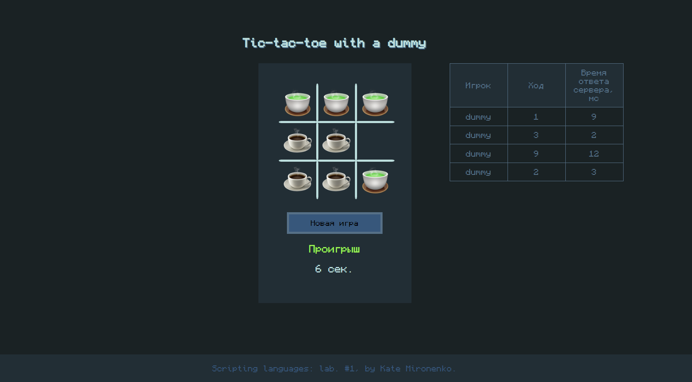

# Getting Started

The project represents a simple tic-tac-toe game which user plays with a server. 
Reset options and game statistics are also available.

###### By default, you play as a ☕ warrior! Sorry, tea enjoyers :)

This project consists of backend (run with **Express.JS**) and fronted servers (run with **React.JS**). Client-side was bootstrapped with [Create React App](https://github.com/facebook/create-react-app).

## How to proceed

To start a backend server, navigate to `/server` folder and execute:

### `npm run dev`

Next, to start a frontend server, navigate to `/client` folder and execute
### `npm start`

Open [http://localhost:3000](http://localhost:3000) to view the app in your browser.

The page will reload when you make changes.\
You may also see any lint errors in the console.

###### P.S. The  project is in W.I.P. state and yet to be optimised and fixed.